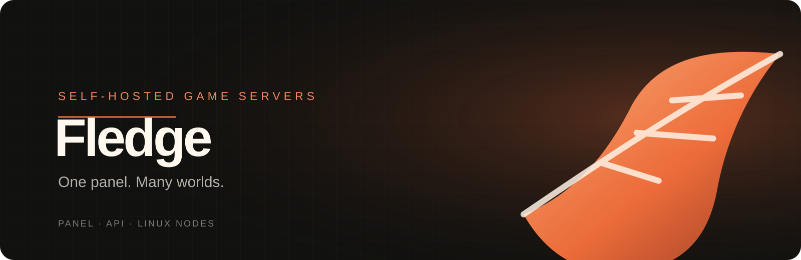

<div align="center">


# Fledge

**A clear home for the game servers you run.**

Manage customers, servers, templates, and Linux Docker nodes from one self-hosted panel.

[Quick start](#quick-start) · [Connect a node](#connect-a-node) · [Documentation](#documentation) · [Known limits](#known-limits)



</div>

> **Version v0.1.0.** Fledge is an actively developed project. It is suitable for local evaluation and controlled testing; it has not completed a production security review.

## What is Fledge?

Fledge is a self-hosted control panel for operating game servers across multiple Linux Docker hosts. The web panel and API manage users, templates, server lifecycle, placement, backups, and audit activity. Outbound Go agents connect Linux nodes to the panel; the panel does not need to expose an inbound agent port.

The visible product, repository, package names, and release assets use **Fledge**. Version 0.1 retains a few internal `navrylo` identifiers for existing database volumes, database roles, session cookies, Docker labels, and agent paths so an in-place rename does not orphan current data or enrolled nodes.

```text
 Browser ── Panel ── API ── PostgreSQL
                         ├── S3-compatible backups
                         └── outbound agents ── Linux Docker nodes ── game servers
```

## Quick start

### Requirements

- Docker Engine with Docker Compose v2
- 4 GB RAM recommended for the panel, database, and a small evaluation workload
- For game nodes: Linux, Docker Engine, and a reachable HTTPS panel URL
- Optional backups: an S3-compatible service reachable from the API, nodes, and browsers

### Install with one command

Run the matching command on a fresh Docker host. It clones the fixed Fledge repository and starts its installer. The GitHub repository is currently private, so authenticate Git before cloning. Review the scripts before running software with administrator/root access.

**Linux / macOS terminal**

```sh
git clone --depth 1 --branch main https://github.com/kavaliersdelikt/fledge.git fledge && cd fledge && sh ./install.sh
```

**Windows PowerShell**

```powershell
git clone --depth 1 --branch main https://github.com/kavaliersdelikt/fledge.git fledge; if ($LASTEXITCODE -ne 0) { throw 'Download failed.' }; Set-Location fledge; if (-not $?) { throw 'Could not enter the install folder.' }; powershell.exe -NoProfile -ExecutionPolicy Bypass -File .\install.ps1; if ($LASTEXITCODE -ne 0) { throw 'Install failed.' }
```

The installer preserves an existing `.env`, generates private local secrets when creating one, starts Docker Compose, and waits for health checks. Windows runs the panel stack in Docker Desktop Linux-container mode. `/install` inside an already running panel is now an operations guide; it links to node enrollment, updates, and the fresh-host instructions here. It does not generate a second panel install command.

### Start from a checkout

```sh
git clone https://github.com/kavaliersdelikt/fledge.git
cd fledge
cp .env.example .env
```

Edit `.env` and set a long URL-safe `POSTGRES_PASSWORD` and a permanent 64-character hex `ENCRYPTION_KEY` (`openssl rand -hex 32`). Then start the stack:

```sh
docker compose up --build -d
```

Open <http://localhost:3000>. The first visit creates the administrator and enrolls an authenticator for two-factor sign-in. The local Compose setup binds the panel and API to loopback and does not start a game node. Keep the encryption key safe: replacing it makes stored encrypted two-factor secrets unreadable.

```sh
docker compose ps
curl http://localhost:4000/api/health
docker compose down
```

`docker compose down -v` deletes the database and local S3 data.

## Connect a node

1. In **Nodes**, register the capacity for a Linux Docker host.
2. Use **Connect a node** to create a one-time enrollment token and copy the generated Linux command. Tokens expire after ten minutes and are shown once.
3. Run the command on the node. It verifies the agent checksum and installs a systemd service. Windows evaluation uses the Linux agent inside WSL2; native Windows agents and macOS node hosts are not supported.
4. Confirm the node is connected before placing a server there.

The agent is a high-trust, root-equivalent component because it controls Docker and server files. Install it only on hosts you administer. Use HTTPS outside local development. The generated node command downloads GitHub release assets without embedding a GitHub credential; while the repository is private, those downloads require an authenticated distribution path. Make the repository public before offering that command broadly.

New game containers keep standard input open. The live console streams Docker logs and resource samples and sends one line to container stdin; game software must support console input this way. Minecraft Java continues to use authenticated RCON. Containers created before this change need a configure/recreate operation before generic stdin input is available. Pterodactyl egg conversion imports environment defaults and editable variables; it does not run install scripts or translate Pterodactyl-specific startup interpolation. Review the generated image, ports, and compatibility warnings before saving.

## Backups and recovery

Configure `S3_BUCKET`, `S3_ACCESS_KEY`, `S3_SECRET_KEY`, `S3_REGION`, and `S3_ENDPOINT` in the API environment. The endpoint must be reachable by the API, every node, and browsers downloading backups. Backups are verified archives, and restore stages files before swapping them into place where Linux filesystem support permits. Cross-node recovery is a manual operation: create a replacement server on another node, restore, verify the game, then update network records.

Backups are not game-aware snapshots. Validate recovery with your game and storage provider before relying on them.

## Updating

Administrators can check GitHub releases in **Updates**. On the Compose host, run `./update.sh v0.1.0` (Linux/macOS) or `./update.ps1 -Version v0.1.0` (PowerShell). The updater requires a clean Git checkout, saves a PostgreSQL dump, rebuilds the selected release, and checks health. It reverts application code if those checks fail; it cannot reverse database schema migrations. Keep an independent backup and review the release notes before updating.

## Documentation

- [API and configuration](api/README.md)
- [Web panel](web/README.md)
- [Linux node agent and WSL2 evaluation](agent/README.md)
- [SFTP status](SFTP_STATUS.md)
- [Environment template](.env.example)

## Known limits

- SFTP is exposed as an optional per-server connection flow; validate the node firewall and client access before using it outside local evaluation.
- Browser file transfers stream through the API and object storage up to 1 GiB; the text editor remains capped at 1 MiB.
- Disk usage can be reported and logical allowances can be applied, but Docker/filesystem hard quotas are not enforced.
- Automatic stateful failover and live migration are not implemented.
- Backup archives are not atomic game-consistent snapshots; scheduled restore checks do not boot a game.
- Console event routing has not been validated under production multi-replica load.
- Pterodactyl conversion covers portable egg fields only; egg install scripts, daemon images, startup interpolation, and stop commands need operator review and are not executed.
- Real AWS S3 retention, two-host recovery, Valheim boot, and native Windows host behavior need dedicated validation.
- Production hardening remains: formal security review, broad rate limiting, account recovery operations, observability, upgrade/migration rollback, and rootless agent operation.

See the component READMEs for current detailed limits. Treat this release as an evaluation build until the deployment and recovery paths have been tested on your own infrastructure.

## Development checks

```sh
# API
cd api && npm ci && npm run check && npm run test:cors && npm run test:updates && npm run test:templates

# Web
cd ../web && npm ci && npm run check && npm run build

# Agent
cd ../agent && go test ./... && go vet ./... && go build ./...
```

The disposable API smoke test is in `tests/api-smoke-disposable.ps1`; it creates and removes a uniquely named PostgreSQL test container/database. Do not point smoke tests at a production database.

## Project status

Contributions and issue reports are welcome; please include reproduction steps and redact credentials, enrollment tokens, and backup URLs. A license has not yet been selected.

