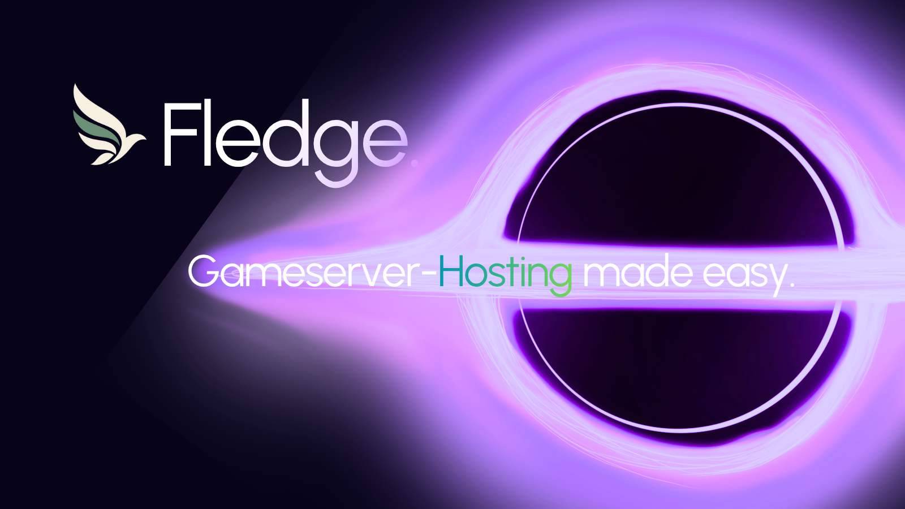

<div align="center">


# Fledge

**A clear home for the game servers you run.**

Manage customers, servers, templates, and Linux Docker nodes from one self-hosted panel.

[Quick start](#quick-start) · [Connect a node](#connect-a-node) · [Documentation](#documentation) · [Known limits](#known-limits)



</div>

> **Version v0.1.1.** Fledge is an actively developed project. It is suitable for local evaluation and controlled testing; it has not completed a production security review.

## What is Fledge?

Fledge is a self-hosted control panel for operating game servers across multiple Linux Docker hosts. The web panel and API manage users, templates, server lifecycle, placement, backups, and audit activity. Outbound Go agents connect Linux nodes to the panel; the panel does not need to expose an inbound agent port.


```text
 Browser ── Panel ── API ── PostgreSQL
                         ├── S3-compatible backups
                         └── outbound agents ── Linux Docker nodes ── game servers
```

## Quick start

### Requirements

- Docker Engine with Docker Compose v2
- 4 GB RAM recommended for the panel, database, and a small evaluation workload
- For game nodes: Linux, Docker Engine, and a reachable HTTPS panel URL
- Optional backups: an S3-compatible service reachable from the API, nodes, and browsers

### Install with one command

Run the matching command on a fresh Docker host.

**Linux / macOS terminal**

```sh
git clone --depth 1 --branch main https://github.com/kavaliersdelikt/fledge.git fledge && cd fledge && sh ./install.sh
```

**Windows PowerShell**

```powershell
git clone --depth 1 --branch main https://github.com/kavaliersdelikt/fledge.git fledge; if ($LASTEXITCODE -ne 0) { throw 'Download failed.' }; Set-Location fledge; if (-not $?) { throw 'Could not enter the install folder.' }; powershell.exe -NoProfile -ExecutionPolicy Bypass -File .\install.ps1; if ($LASTEXITCODE -ne 0) { throw 'Install failed.' }
```

The installer preserves an existing `.env`, generates private local secrets when creating one, starts Docker Compose, and waits for health checks. Windows runs the panel stack in Docker Desktop Linux-container mode.

### Start from a checkout

```sh
git clone https://github.com/kavaliersdelikt/fledge.git
cd fledge
cp .env.example .env
```

Edit `.env` and set a long URL-safe `POSTGRES_PASSWORD` and a permanent 64-character hex `ENCRYPTION_KEY` (`openssl rand -hex 32`). Then start the stack:

```sh
docker compose up --build -d
```

Open <http://localhost:3000>. The first visit creates the administrator and enrolls an authenticator for two-factor sign-in. The local Compose setup binds the panel and API to loopback and does not start a game node. Keep the encryption key safe: replacing it makes stored encrypted two-factor secrets unreadable.

```sh
docker compose ps
curl http://localhost:4000/api/health
docker compose down
```

`docker compose down -v` deletes the database and local S3 data.

## Connect a node

1. In **Nodes**, register the capacity for a Linux Docker host.
2. Use **Connect a node** to create a one-time enrollment token and copy the generated Linux command. Tokens expire after ten minutes and are shown once.
3. Run the command on the node. It verifies the agent checksum and installs a systemd service. Windows evaluation uses the Linux agent inside WSL2; native Windows agents and macOS node hosts are not supported.
4. Confirm the node is connected before placing a server there.

The agent is a high-trust, root-equivalent component because it controls Docker and server files. Install it only on hosts you administer. Use HTTPS outside local development. 

New game containers keep standard input open. The live console streams Docker logs and resource samples and sends one line to container stdin; game software must support console input this way. Minecraft Containers are preset to use authenticated RCON. Containers created before this change need a configure/recreate operation before generic stdin input is available. Pterodactyl egg conversion imports environment defaults and editable variables; it does not run install scripts or translate Pterodactyl-specific startup interpolation. Review the generated image, ports, and compatibility warnings before saving.

## Backups and recovery

Configure `S3_BUCKET`, `S3_ACCESS_KEY`, `S3_SECRET_KEY`, `S3_REGION`, and `S3_ENDPOINT` in the API environment. The endpoint must be reachable by the API, every node, and browsers downloading backups. Backups are verified archives, and restore stages files before swapping them into place where Linux filesystem support permits. Cross-node recovery is a manual operation: create a replacement server on another node, restore, verify the game, then update network records.

Backups are not game-aware snapshots. Validate recovery with your game and storage provider before relying on them.

## Updating

Administrators can check and install the latest GitHub release directly from **Updates**. Select **Update panel** to start the process. The panel creates a PostgreSQL dump in `.backups/`, keeps the Compose database and S3 volumes and the existing `.env`, rebuilds only the API and web services, and checks both services before reporting success. If health checks fail, it restores the previous application revision when possible. Database schema migrations are not reversed automatically, so keep an independent backup and review the release notes before updating.

The in-panel updater runs as a private Compose service and needs access to the Docker Engine socket and the project checkout. Keep the updater service on the internal Compose network; it is not published to the host. This grants the updater host-level control over Docker, so protect access to the Docker daemon and install Fledge only on a host you administer. The existing `update.sh` and `update.ps1` scripts remain available for manual recovery and clean-checkout installs.

## Documentation

- [API and configuration](api/README.md)
- [Web panel](web/README.md)
- [Linux node agent and WSL2 evaluation](agent/README.md)
- [SFTP status](SFTP_STATUS.md)
- [Environment template](.env.example)

## Known limits

- SFTP is implemented with short-lived per-server credentials and confined paths. Enable it explicitly on each Linux agent and restrict its SSH port with the host firewall; it has not been field-tested with third-party clients on a dedicated node.
- Browser file transfers stream through object storage up to 1 GiB; the text editor remains capped at 1 MiB. The older 8 MiB API transfer routes remain for compatibility.
- Per-server disk allowances guard panel and SFTP writes, and disk usage is reported, but they are not kernel-enforced filesystem quotas. Game processes can exceed the allowance.
- Automatic stateful failover and live migration are not implemented. Cross-node recovery is manual: provision a replacement, restore a backup, verify the game, then update network records. Do not attach the same writable server data to two nodes.
- Backups ask Docker to stop a running game cleanly before archiving and restart it afterward. They are still archives rather than atomic filesystem snapshots; consistency depends on the game handling Docker's stop signal and the host filesystem remaining stable. Scheduled verification checks archive integrity and safe extraction; it does not boot a game.
- Console events and node ownership are routed through PostgreSQL for multiple API replicas, but a sustained multi-replica load and failover drill has not been run.
- Pterodactyl conversion covers portable egg fields only; egg install scripts, daemon images, startup interpolation, and stop commands need operator review and are not executed.
- This checkout was exercised with a real Minecraft Java boot, console command, file listing, Docker resource sample, 108 MiB S3-compatible backup download, and successful restore on Docker Desktop with a WSL2 agent. Real AWS S3 retention, Valheim boot, and a separate two-host recovery drill still need dedicated validation. Windows Docker Desktop is for local Linux-container and WSL2-agent evaluation; native Windows services and Windows containers are unsupported.
- The API has shared request throttles, one-time account recovery codes, admin-only Prometheus metrics, and an updater that restores application code if its health check fails. These controls do not replace a formal production security review. Database migrations are not automatically reversed; account recovery requires previously saved recovery codes; and the Linux agent still has root-equivalent Docker access. Rootless operation, load testing, external monitoring, and credential-rotation operations remain unvalidated.

See [v0.1.1 release notes](docs/releases/v0.1.1.md) and the component READMEs for verification details. Treat this release as an evaluation build until you have tested deployment and recovery on your own infrastructure.

## Development checks

```sh
# API
cd api && npm ci && npm run check && npm run test:cors && npm run test:updates && npm run test:templates

# Web
cd ../web && npm ci && npm run check && npm run build

# Agent
cd ../agent && go test ./... && go vet ./... && go build ./...
```

The disposable API smoke test is in `tests/api-smoke-disposable.ps1`; it creates and removes a uniquely named PostgreSQL test container/database. Set `FLEDGE_SMOKE_S3=true` and provide `S3_BUCKET`, `S3_ACCESS_KEY`, `S3_SECRET_KEY`, `S3_REGION`, and a host-reachable `S3_ENDPOINT` to include streamed object and retention checks against an S3-compatible test bucket. It writes only unique `smoke/` objects and cleans up its fixtures. Do not point smoke tests at a production database or bucket.

## Project status

Contributions and issue reports are welcome; please include reproduction steps and redact credentials, enrollment tokens, and backup URLs. 
