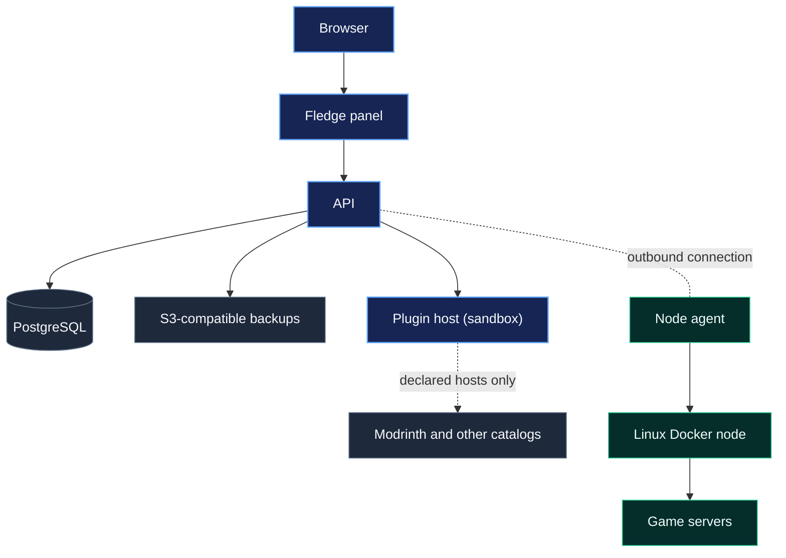

<div align="center">


# Fledge

**A clear home for the game servers you run.**

Manage customers, servers, templates, and Linux Docker nodes from one self-hosted panel.

<p>
  <a href="https://github.com/kavaliersdelikt/fledge/releases"></a>
  <a href="LICENSE.md"></a>
  <a href="https://github.com/kavaliersdelikt/fledge/stargazers"></a>
  <a href="https://github.com/kavaliersdelikt/fledge/issues"></a>
  <a href="#known-limits"></a>
</p>

[Overview](#what-is-fledge) · [Quick start](#quick-start) · [Connect a node](#connect-a-node) · [Documentation](#documentation) · [Community](#community) · [Known limits](#known-limits)


<p>
  <a href="https://discord.gg/gu49ZF6tQh"></a>
  <a href="#quick-start"></a>
  <a href="#documentation"></a>
  <a href="https://github.com/kavaliersdelikt/fledge/releases"></a>
</p>

**Building your own game server setup? Come build it with us.**<br />
Ask setup questions, share your servers, and help shape what Fledge becomes.


</div>

> **Version v0.7.1.1 (Rookery)** Fledge is an actively developed project. It is suitable for local evaluation and controlled testing; it has not completed a production security review.
>
> **License:** GNU Affero General Public License v3.0 only (AGPL-3.0-only). See [LICENSE.md](LICENSE.md). Modified versions offered as a network service must provide their corresponding source under the license terms.

## What is Fledge?

Fledge is a self-hosted control panel for operating game servers across multiple Linux Docker hosts. The web panel and API manage users, templates, server lifecycle, placement, backups, automation, plugins and audit activity. Outbound Go agents connect Linux nodes to the panel; the panel does not need to expose an inbound agent port. Plugins run in a sandboxed host service that has no access to the database or to Docker.



```mermaid
flowchart TB
    Browser["Browser"] --> Panel["Fledge panel"]
    Panel --> API["API"]

    API --> Database[("PostgreSQL")]
    API --> Backups["S3-compatible backups"]

    API --> Plugins["Plugin host (sandbox)"]
    Plugins -. "declared hosts only" .-> Catalogs["Modrinth and other catalogs"]
    API -. "outbound connection" .- Agent["Node agent"]
    Agent --> Node["Linux Docker node"]
    Node --> Servers["Game servers"]

    classDef app fill:#172554,stroke:#60A5FA,color:#F8FAFC,stroke-width:1.5px
    classDef data fill:#1E293B,stroke:#64748B,color:#F8FAFC
    classDef node fill:#052E2B,stroke:#34D399,color:#F0FDFA

    class Browser,Panel,API,Plugins app
    class Database,Backups data
    class Agent,Node,Servers node
    class Catalogs data
```

## What you get

| | |
|---|---|
| **Live servers** | Real CPU and memory graphs from each node's samples, disk use, and a console that keeps its history across tabs. |
| **Whole-fleet view** | One overview that lists each offline node or failed server once, with the error and a link to fix it. |
| **Placement that fits** | Servers go to a node with free capacity. Each node shows its reserved memory split per server. |
| **Files and backups** | Browser file manager and editor, drag-and-drop upload, temporary SFTP credentials, S3 backups with retention and restore checks. |
| **People and access** | Customer accounts, per-server collaborators (view, console, files, backups, manage), an audit log, and scoped API tokens. |
| **Safe by default** | Two-factor authentication required for administrators, recovery codes, and outbound-only node agents. |
| **Fast to drive** | Ctrl K searches pages and servers. Works on phones. Motion respects "reduce motion". |
| **Plugins and add-ons** | A plugin store with one-click install, permission review and a settings wizard. The bundled **Modrinth Mod Browser** and **Modrinth Plugin Browser** add a Mods or Plugins tab to matching Minecraft servers: search, dependencies, install, update, disable, remove. |
| **Autopilot** | Schedules with cron and task chains (command, wait, backup, restart), automatic restart after crashes with crash-loop protection, a notification inbox with Discord, Slack, webhook and email delivery. |
| **Templates v2** | Typed variables, import and export, versions with "update servers", extra ports, clone server. |
| **Accounts** | Passkeys, signed-in devices, email invitations and password reset, an optional admin network allow-list, audit filters and export. |
| **Customer sign-up** | Optional self-registration with email confirmation, approval or invite-only modes, bot protection (Turnstile or hCaptcha), rate limits that pause sign-up during a flood, account changes, data download and deletion. |
| **Self-service servers** | Customers create (and delete) their own servers within their limits, from templates you release. |
| **Limits v2** | Layered limits (panel defaults, plans, per-customer overrides) that explain themselves, and that can be switched off or set to warn only. |
| **Plans and a store** | Sell preset servers or allowances monthly, quarterly, half-yearly or yearly, with trials, setup fees, stock and free tiers. Stripe is included (card data never touches the panel); signed, de-duplicated webhooks, a scheduled comparison with the provider, late-payment handling that stops servers instead of deleting them, refunds, disputes and complimentary plans. |
| **Email you can edit** | Every email is a template with a live preview, sent through a retrying outbox with a delivery log, receipts, reminders and security notices. |
| **Your own brand** | Rename the panel, add a logo, pick colours and a font, offer light and dark, restyle the sign-in page, add sidebar links and an announcement. Readable colours are enforced, a 60-second preview rolls itself back, and the last 20 versions are kept. |
| **History and API** | CPU and memory history (1 hour to 30 days), Prometheus metrics, an OpenAPI description with an in-panel API reference. |

> **New in v0.7.1.1 "Rookery", the Hosting Update:** let people sign up, create servers and buy them. Plans, a store, subscriptions with dunning and suspension, a bundled Stripe plugin (verified against Stripe's test mode), limits that can be layered, switched off or set to warn, and editable emails with a delivery log. Everything is off by default, so an existing panel behaves exactly as before. See the [release notes](https://kavaliersdelikt.github.io/fledge/releases/v0.7.1.1), [Going live](https://kavaliersdelikt.github.io/fledge/operate/selling) and the [Store guide](https://kavaliersdelikt.github.io/fledge/panel/store).
>
> **v0.6.2.1 "Plumage", the Customizing Update:** make the panel your own from **Settings, Appearance**: name, logo, colours, fonts, light and dark, a restyled sign-in page, sidebar links and announcements, with readability checks, a preview that undoes itself, version history and a safe mode. Nothing changes until you save something. See the [release notes](https://kavaliersdelikt.github.io/fledge/releases/v0.6.2.1) and the [Appearance guide](https://kavaliersdelikt.github.io/fledge/panel/appearance).
>
> **Earlier: v0.6.1.1 "Roost"**: added the plugin system with Modrinth mod and plugin browsers, schedules and crash protection, a notification center, template v2, quotas and passkeys (update node agents to 0.6.1.1 or newer for add-ons); v0.5.2.1 added automatic failover and planned moves, v0.5.1.1 kernel-enforced disk limits and agent updates from the panel. Release notes: [v0.6.1.1](https://kavaliersdelikt.github.io/fledge/releases/v0.6.1.1). a plugin system (sandboxed, signed, one-click) with Modrinth mod and plugin browsers, schedules and crash protection, a notification center, template v2, quotas, passkeys and more. Update the node agents to 0.6.1.1 to use add-ons. See the [release notes](https://kavaliersdelikt.github.io/fledge/releases/v0.6.1.1). Earlier: v0.5.2.1 added automatic failover and planned moves, v0.5.1.1 kernel-enforced disk limits and agent updates from the panel.

## Quick start

### Requirements

- Docker Engine with Docker Compose v2
- 4 GB RAM recommended for the panel, database, and a small evaluation workload
- For game nodes: Linux, Docker Engine, and a reachable HTTPS panel URL
- Optional backups: an S3-compatible service reachable from the API and nodes (set up in the panel, not `.env`)

### Install with one command

Run the matching command on a fresh Docker host.

**Linux / macOS terminal**

```sh
git clone --depth 1 --branch main https://github.com/kavaliersdelikt/fledge.git fledge && cd fledge && sh ./install.sh
```

**Windows PowerShell**

```powershell
git clone --depth 1 --branch main https://github.com/kavaliersdelikt/fledge.git fledge; if ($LASTEXITCODE -ne 0) { throw 'Download failed.' }; Set-Location fledge; if (-not $?) { throw 'Could not enter the install folder.' }; powershell.exe -NoProfile -ExecutionPolicy Bypass -File .\install.ps1; if ($LASTEXITCODE -ne 0) { throw 'Install failed.' }
```

The installer preserves an existing `.env`, generates private local secrets when creating one, starts Docker Compose, and waits for health checks. Windows runs the panel stack in Docker Desktop Linux-container mode.

### Start from a checkout

```sh
git clone https://github.com/kavaliersdelikt/fledge.git
cd fledge
cp .env.example .env
```

Edit `.env` and set a long URL-safe `POSTGRES_PASSWORD` and a permanent 64-character hex `ENCRYPTION_KEY` (`openssl rand -hex 32`). Then start the stack:

```sh
docker compose up --build -d
```

Open <http://localhost:3000>. The first visit creates the administrator and enrolls an authenticator for two-factor sign-in. The local Compose setup binds the panel and API to loopback and does not start a game node. Keep the encryption key safe: replacing it makes stored encrypted two-factor secrets unreadable.

```sh
docker compose ps
curl http://localhost:4000/api/health
docker compose down
```

`docker compose down -v` deletes the database and local S3 data.

## Connect a node

A node is a Linux host with systemd and Docker Engine already installed. In the panel, open **Nodes**, register the node's capacity and
location, use **Connect a node** for a one-time command (valid ten minutes) and run it on the host. The connector verifies the agent's
checksum, enrolls it and installs a systemd service. The agent only connects **out** to the panel and is root-equivalent: install it
only on hosts you administer. For a local Windows evaluation use WSL2 with Docker Desktop. See
[Connect a node](https://kavaliersdelikt.github.io/fledge/agent/connect) and the [WSL2 guide](https://kavaliersdelikt.github.io/fledge/agent/wsl2).

## Documentation

Everything is documented at **<https://kavaliersdelikt.github.io/fledge/>** (built from [`docs-site/`](docs-site)).

| I want to... | Read |
| --- | --- |
| Understand what Fledge is and how it fits together | [What is Fledge?](https://kavaliersdelikt.github.io/fledge/guide/what-is-fledge) and [Concepts](https://kavaliersdelikt.github.io/fledge/guide/concepts) |
| Install, put it behind TLS, update, back up, monitor | [Operate](https://kavaliersdelikt.github.io/fledge/operate/install) |
| Use servers, schedules, crash protection, notifications, quotas, templates | [Panel guide](https://kavaliersdelikt.github.io/fledge/panel/servers) |
| Sell servers: sign-up, plans, the store, billing, limits, emails | [Going live](https://kavaliersdelikt.github.io/fledge/operate/selling), [Plans](https://kavaliersdelikt.github.io/fledge/panel/plans), [The store](https://kavaliersdelikt.github.io/fledge/panel/store), [Billing](https://kavaliersdelikt.github.io/fledge/panel/billing), [Limits](https://kavaliersdelikt.github.io/fledge/panel/limits) and the [Stripe plugin](https://kavaliersdelikt.github.io/fledge/plugins/stripe) |
| Brand the panel: name, logo, colours, light and dark | [Appearance](https://kavaliersdelikt.github.io/fledge/panel/appearance) and [recovering from a bad theme](https://kavaliersdelikt.github.io/fledge/operate/branding-recovery) |
| Connect and run nodes, disk limits, the WSL2 evaluation setup | [Node agent](https://kavaliersdelikt.github.io/fledge/agent/) |
| Install or write plugins | [Plugins](https://kavaliersdelikt.github.io/fledge/plugins/) and the [tutorial](https://kavaliersdelikt.github.io/fledge/plugins/tutorial) |
| Integrate with the HTTP API | [API](https://kavaliersdelikt.github.io/fledge/api/) and the generated [endpoint reference](https://kavaliersdelikt.github.io/fledge/api/reference/) |
| Look up environment variables, events, database tables | [Reference](https://kavaliersdelikt.github.io/fledge/reference/) |
| Harden an installation, verify a release | [Security](https://kavaliersdelikt.github.io/fledge/security/) |
| Hack on Fledge | [Development](https://kavaliersdelikt.github.io/fledge/dev/) |
| See what changed | [Release notes](https://kavaliersdelikt.github.io/fledge/releases/) |

## Known limits

Fledge is for evaluation and controlled testing. The honest list is in the docs ([overview](https://kavaliersdelikt.github.io/fledge/guide/what-is-fledge#known-limits)
and each release's notes). Highlights:

- No production security review, load test or multi-replica drill has been done; the node agent is root-equivalent.
- Failover is backup-based: data written since the newest backup is lost.
- Disk limits need a Linux node with root, loop devices and `e2fsprogs`.
- Plugin sandboxing reduces risk but is not a formal guarantee; downloaded mod and plugin files are not scanned.
- Appearance is one look per panel (no different brand per domain); only the sidebar pages can be renamed; custom CSS can hide parts of the panel (safe mode and `BRANDING_DISABLED` recover).
- Billing: Stripe is the only payment provider so far; tax calculation, invoicing rules and consumer law are your responsibility; there is no usage-based billing, prepaid credit or reseller feature. It was verified against Stripe's test mode and a signed stand-in, not yet with real customers.
- Native Windows and macOS nodes are not supported; WSL2 with Docker Desktop is for local evaluation only.

## Development

```sh
cd api && npm ci && npm run check && npm run test:unit      # more suites: see the docs
cd plugins/host && npm ci && npm test
cd web && npm ci && npm run check && npx tsx --test src/lib/*.test.ts && npm run build
cd agent && go vet ./... && go test ./...
```

The full list of suites, how to run the integration tests against a throw-away PostgreSQL, and how the docs are built are in the
[development guide](https://kavaliersdelikt.github.io/fledge/dev/tests).

## Community

<div align="center">

<a href="https://discord.gg/gu49ZF6tQh"></a>
<a href="https://github.com/kavaliersdelikt/fledge"></a>

</div>

| Want to… | Start here |
| --- | --- |
| Ask a setup question or share your server | [Join Discord](https://discord.gg/gu49ZF6tQh) |
| Report a bug | [Open an issue](https://github.com/kavaliersdelikt/fledge/issues/new) with reproduction steps and relevant logs |
| Suggest an improvement | [Share an idea](https://github.com/kavaliersdelikt/fledge/issues/new) and describe the problem it would solve |
| Report a vulnerability | [Privately](https://github.com/kavaliersdelikt/fledge/security/advisories/new), see [SECURITY.md](SECURITY.md) |
| Contribute code | Start with the [open issues](https://github.com/kavaliersdelikt/fledge/issues) and the [development guide](https://kavaliersdelikt.github.io/fledge/dev/) |

Please redact credentials, enrollment tokens, and backup URLs before sharing logs or screenshots.

## Project status

Contributions and issue reports are welcome; please include reproduction steps and redact credentials, enrollment tokens, and backup URLs.
