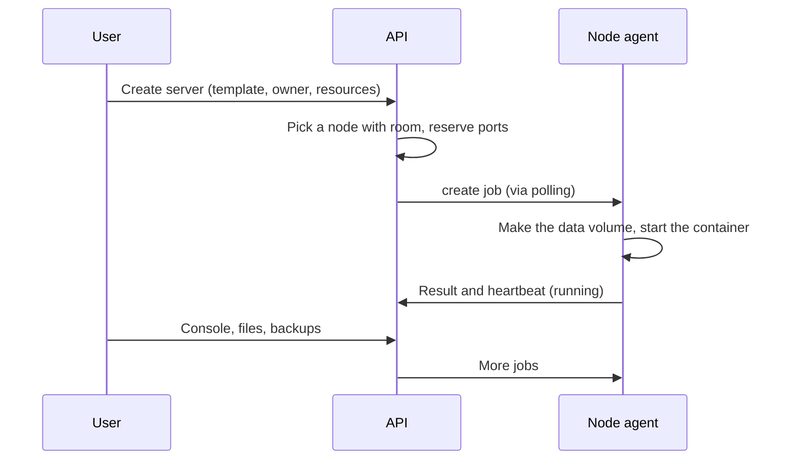

# Concepts

| Term | Meaning |
| --- | --- |
| **Administrator** | A provider account. Can manage nodes, customers, templates, plugins and settings. Must use two-factor sign-in. |
| **Customer** | A normal account that owns servers. Limited by an optional [quota](/panel/customers). |
| **Collaborator** | A user invited to one server with some of `view`, `console`, `files`, `backups`, `manage`. |
| **Node** | A Linux host running Docker and the Fledge agent. Has a capacity (memory, CPU, disk) and a location label. |
| **Server** | One game server container plus its data volume, owned by a customer and placed on a node. |
| **Template** | A recipe for a kind of server: image, startup command, ports, environment, variables, default resources. Templates are versioned. |
| **Job** | A durable unit of work for a node (create, start, stop, backup, file operations...). The agent polls for jobs and reports results. |
| **Allocation** | A host port reserved for a server on a node. A server's base port plus offsets from its template and extra ports. |
| **Add-on** | A mod or plugin file installed into a server's folder by a catalog plugin, tracked by the panel. |
| **Plugin** | A sandboxed program that extends the panel (today: add-on catalogs and event hooks). |
| **Schedule** | A cron or interval rule that runs a chain of steps on a server (command, wait, backup, power). |
| **Quota** | Per-customer limits on servers, memory, CPU, disk, backups and extra ports. |
| **Failover** | Re-creating a server from its newest backup on another node after its node has been silent too long. |
| **Resilience** | The page that shows backup freshness, failover readiness and history. |

## Lifecycle of a server

Everything the panel asks of a node is a job. Jobs are leased, can be retried, and are idempotent where it matters, so
a lost connection does not lose or duplicate work.
