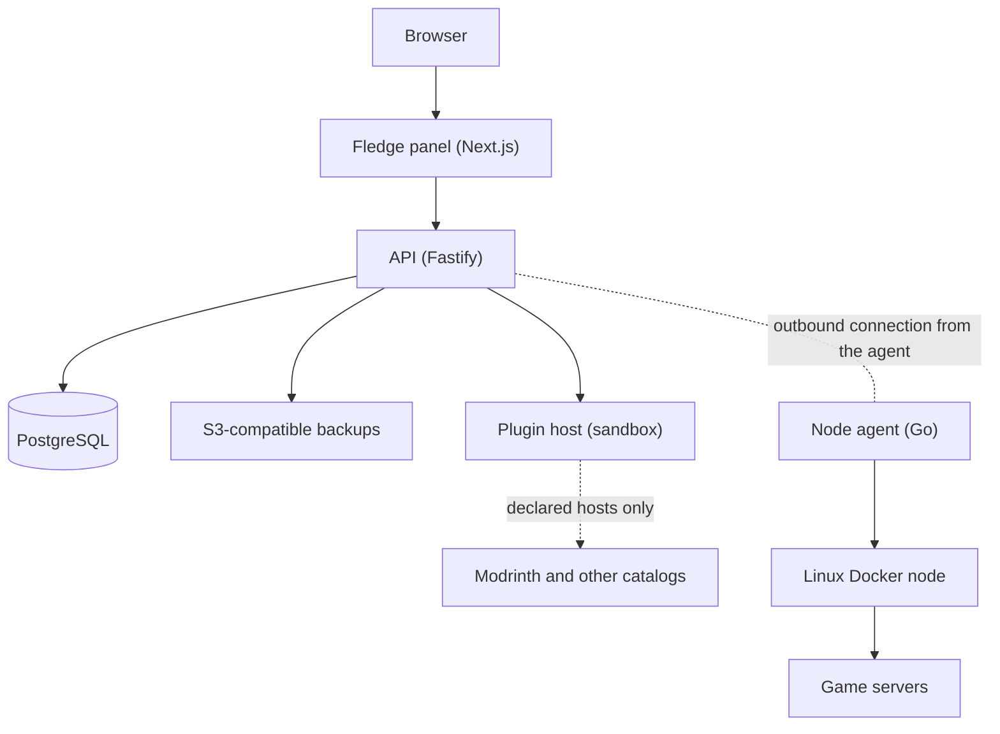

# What is Fledge?

Fledge is a self-hosted control panel for operating game servers across several Linux Docker hosts. You run the
panel once; small outbound-only agents on your machines do the work, so the panel never needs an inbound
connection to a node. Create customer accounts, provision servers from templates, and let Fledge place them
where there is capacity. You can also offer customer self-service and sell managed servers or account plans.

> Fledge is actively developed and suitable for evaluation and controlled testing. It has not completed a
> production security review. See [Known limits](/guide/what-is-fledge#known-limits).

## Architecture

| Part | What it is | Where it runs |
| --- | --- | --- |
| **Panel** | The web interface | Docker Compose service `web` |
| **API** | Accounts, placement, jobs, automation, plugins, audit | Compose service `api` |
| **PostgreSQL** | All state; the schema is applied at startup | Compose service `postgres` |
| **Plugin host** | Runs plugins in a WebAssembly sandbox with no database or Docker access | Compose service `plugins` |
| **Updater** | Performs in-panel updates | Compose service `updater` |
| **Node agent** | Polls the API for jobs and runs them with the local Docker engine | Each game node, as a systemd service |

The agent connects **out** to the panel. The panel never needs an inbound connection to a node.

## What you get

- **Servers**: provision Minecraft Java and Bedrock, Valheim, Node, Python, Go, Bun and .NET servers from
  templates, or import Pterodactyl eggs. Each server has a live console with history, a file manager and editor,
  temporary SFTP credentials, extra ports, cloning, and CPU and memory history from one hour to 30 days.
  [Kernel-enforced disk limits](/agent/disk-limits) are available on supported Linux nodes.
- **Placement**: each server lands on a node with free capacity; each node shows its reservations.
- **Backups and recovery**: verified S3 backups, retention, restore, [automatic failover](/operate/failover)
  and planned moves.
- **Autopilot**: [schedules](/panel/schedules) with chained steps, [crash protection](/panel/crash-protection),
  a [notification center](/panel/notifications) with Discord, Slack, webhook and email.
- **Plugins and add-ons**: a sandboxed [plugin system](/plugins/) with a built-in store, permission review and
  signed registries. The bundled Modrinth Mod Browser (Fabric, Quilt, Forge and NeoForge) and Modrinth Plugin
  Browser (Paper, Purpur, Folia and Spigot) manage mods and plugins from the server page, with dependency handling
  and checksum verification.
- **Plans and billing**: optionally sell preset servers or account plans through Stripe, with monthly, quarterly,
  half-yearly or yearly prices, trials, setup fees and stock limits. Manage checkout, subscriptions, invoices,
  refunds and disputes. Signed webhooks are processed with retries, provider state is reconciled, and late or ended
  subscriptions follow configurable suspension and retention rules. Account plans can grant limits and permission
  to create fixed-size servers from approved templates and locations.
- **Customer self-service**: optionally enable sign-up, email confirmation and approval. Customers can manage
  eligible subscriptions and create or delete servers within their effective limits. Limits combine panel
  defaults, plan allowances and per-customer overrides.
- **People and communication**: customer accounts, email invitations, per-server collaborators with fine-grained
  permissions, editable email templates and a filterable, exportable audit log.
- **Security**: mandatory two-factor for administrators, [passkeys](/panel/account-security), an optional admin
  network allow-list, signed-in device management and scoped API tokens.
- **Your own brand**: rename the panel, add a logo, pick colours and a font, offer light and dark, restyle the
  sign-in page, add sidebar links and an announcement, all from [Appearance](/panel/appearance).
- **Integration and operations**: an [OpenAPI-described HTTP API](/api/), Prometheus metrics, webhooks and
  in-panel updates. Administrators configure hosting, sign-up, billing, email, limits and appearance in the panel.

## Known limits

- Evaluation status: no production security review, no load or multi-replica drill.
- Failover is backup-based, not replication; data written since the newest backup is lost.
- Disk limits need a Linux node with root, loop devices and `e2fsprogs`; the container's writable layer is not limited.
- Plugin sandboxing reduces risk but is not a formal guarantee, and downloaded mod files are not scanned.
- Native Windows and macOS nodes are not supported; WSL2 with Docker Desktop works for local evaluation only.

More in [Status and known gaps](/guide/status) and in the [release notes](/releases/) of each version.
