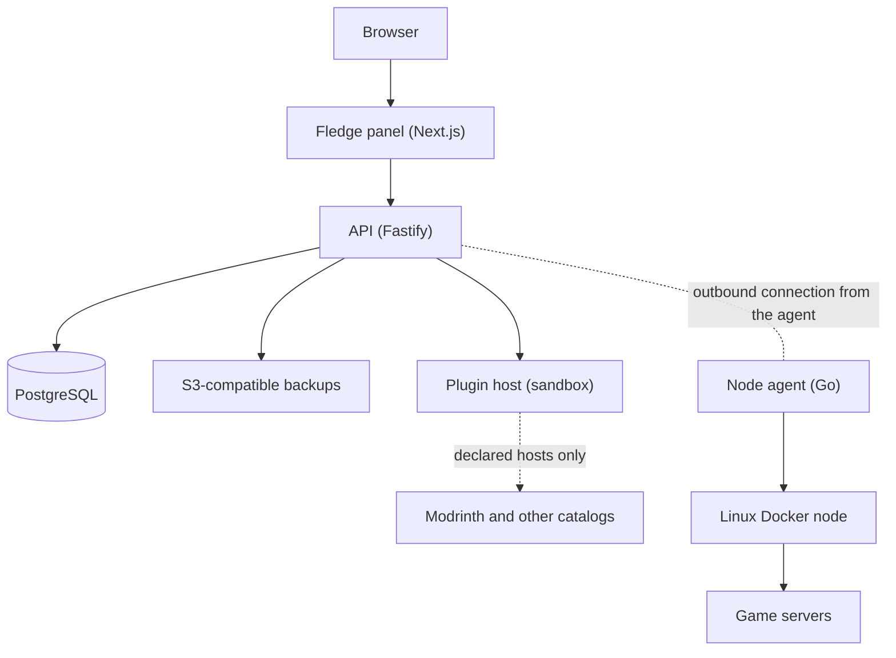

# What is Fledge?

Fledge is a self-hosted control panel for operating game servers across several Linux Docker hosts. You run the
panel once; small outbound-only agents on your Linux machines ("nodes") do the work. People get accounts, servers
get placed where there is room, and everything from consoles to backups to crash recovery happens in the browser.

> Fledge is actively developed and suitable for evaluation and controlled testing. It has not completed a
> production security review. See [Known limits](/guide/what-is-fledge#known-limits).

## Architecture

| Part | What it is | Where it runs |
| --- | --- | --- |
| **Panel** | The web interface | Docker Compose service `web` |
| **API** | Accounts, placement, jobs, automation, plugins, audit | Compose service `api` |
| **PostgreSQL** | All state; the schema is applied at startup | Compose service `postgres` |
| **Plugin host** | Runs plugins in a WebAssembly sandbox with no database or Docker access | Compose service `plugins` |
| **Updater** | Performs in-panel updates | Compose service `updater` |
| **Node agent** | Polls the API for jobs and runs them with the local Docker engine | Each game node, as a systemd service |

The agent connects **out** to the panel. The panel never needs an inbound connection to a node.

## What you get

- **Servers**: provision from templates, live CPU and memory, a console that keeps its history, file manager,
  temporary SFTP credentials, [kernel-enforced disk limits](/agent/disk-limits).
- **Placement**: each server lands on a node with free capacity; each node shows its reservations.
- **Backups and recovery**: verified S3 backups, retention, restore, [automatic failover](/operate/failover)
  and planned moves.
- **Autopilot**: [schedules](/panel/schedules) with chained steps, [crash protection](/panel/crash-protection),
  a [notification center](/panel/notifications) with Discord, Slack, webhook and email.
- **Plugins and add-ons**: a [plugin system](/plugins/) with a store; the bundled Modrinth browsers install mods
  and plugins safely.
- **People**: customers, collaborators with fine-grained permissions, [quotas](/panel/customers), an audit log.
- **Security**: mandatory two-factor for administrators, [passkeys](/panel/account-security), an optional admin
  network allow-list, scoped API tokens.
- **Integration**: an [OpenAPI-described HTTP API](/api/), Prometheus metrics, webhooks.

## Known limits

- Evaluation status: no production security review, no load or multi-replica drill.
- Failover is backup-based, not replication; data written since the newest backup is lost.
- Disk limits need a Linux node with root, loop devices and `e2fsprogs`; the container's writable layer is not limited.
- Plugin sandboxing reduces risk but is not a formal guarantee, and downloaded mod files are not scanned.
- Native Windows and macOS nodes are not supported; WSL2 with Docker Desktop works for local evaluation only.

More in [Status and known gaps](/guide/status) and in the [release notes](/releases/) of each version.
