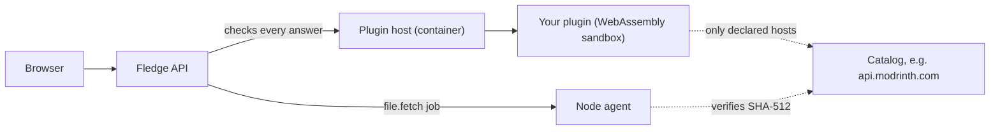

# Plugins

A Fledge plugin is a small, sandboxed JavaScript program that extends the panel. The panel draws the interface and
enforces the rules; the plugin supplies data. In Fledge 0.6 the extension point is the **catalog**: a plugin that can
search a source of mods, plugins or other add-ons and say which files make up a version. The panel adds the browser, the
dependency review, the safe download to the node, updates and removal. Plugins can also receive **hooks** (server and
add-on events).

Two plugins ship with Fledge: **Modrinth Mod Browser** and **Modrinth Plugin Browser**. See
[The bundled plugins](/plugins/bundled).

::: tip Where to go
- **Administrators:** [Using the store](/plugins/using), then [Security model](/plugins/security).
- **Developers:** [Tutorial: your first catalog](/plugins/tutorial), then the reference pages.
:::

## How a plugin runs



- Your code runs in **QuickJS compiled to WebAssembly** inside the `plugins` container. It has its own heap and **no**
  Node APIs, file system, timers or sockets. The only door out is the `host` object.
- The plugin host has no database credentials, no Docker socket and no published port. Only the API can call it, with a
  shared token.
- Every call has limits on time (25 s), memory (64 MB), requests (40) and response size (see [Limits](/plugins/limits)).
  A plugin that keeps failing is switched off automatically.
- Whatever a plugin returns is **validated by the panel** before anything happens: file names, checksums, download hosts
  and sizes are checked again, and the node verifies the checksum itself.

## Package layout

A package is a zip named `<id>-<version>.fledgeplugin`:

```text
fledge-plugin.json    manifest (required)
index.js              your code, one script (required, up to 1 MB)
icon.svg | icon.png   shown in the store (optional, up to 100 KB)
README.md             shown in the plugin's About tab (optional)
CHANGELOG.md          optional
```

## Trust tiers

| Tier | Source | Installable when |
| --- | --- | --- |
| **Bundled** | Ships in the panel image | Always (you still approve its permissions) |
| **Verified** | A registry entry signed by a key you trust | Always (you approve permissions) |
| **Community** | Unsigned registry entry or an uploaded file | Only after you turn on *Allow community plugins* |

Details and what is and is not claimed: [Plugin security model](/plugins/security).

## What plugins cannot do (yet)

Plugins cannot add pages or routes to the panel, define their own notification channels or call the panel's API. The
interface covers catalogs, event hooks and, since 0.7.1.1, payment providers (see [the payments contract](/plugins/payments); a
payment provider still cannot add pages or call the rest of the panel). Custom plugin UI is a candidate for a later release.
